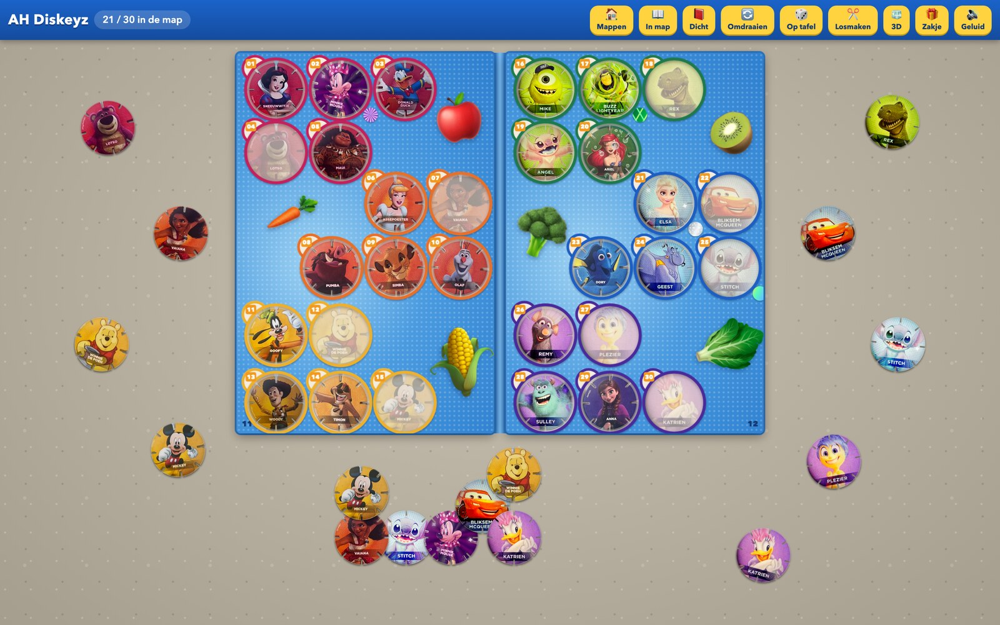
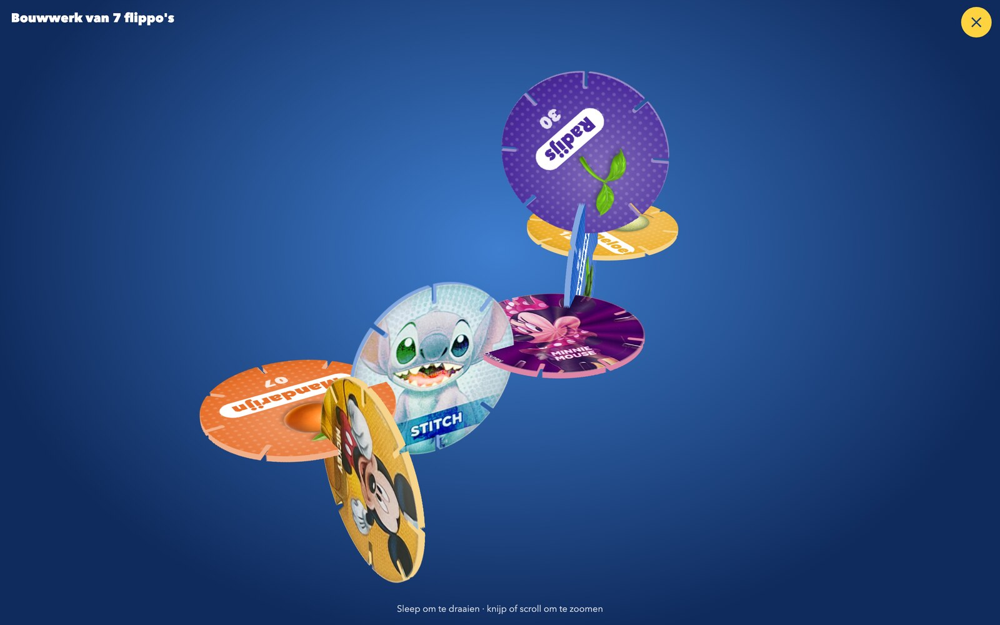
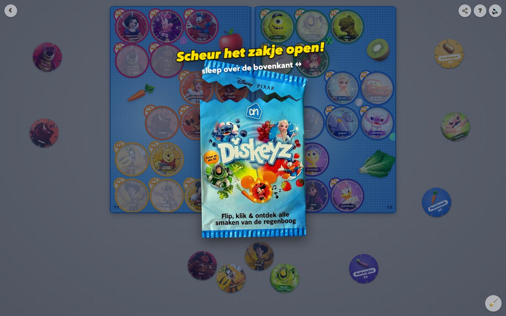
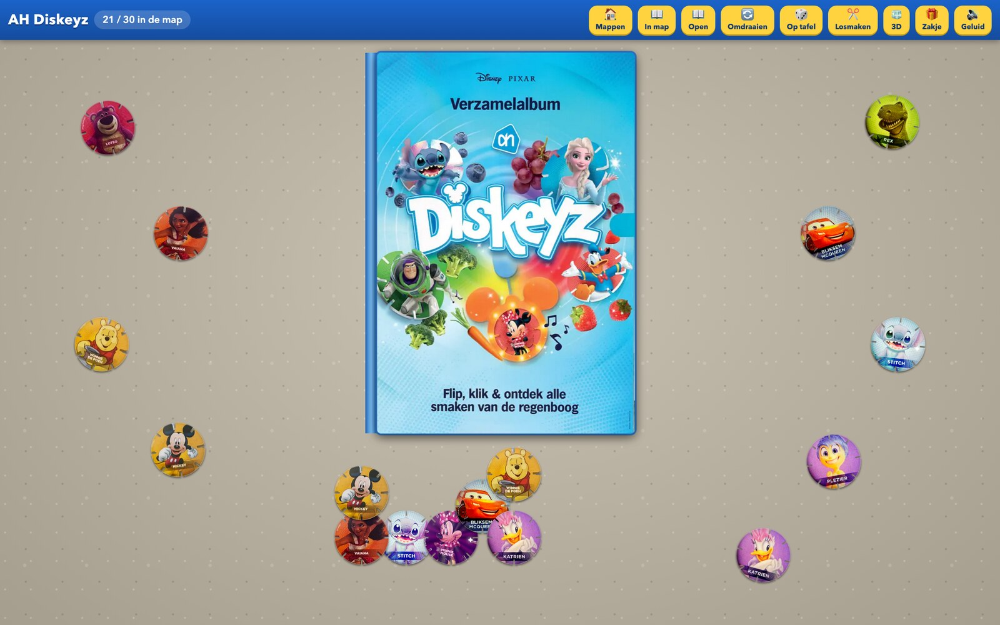
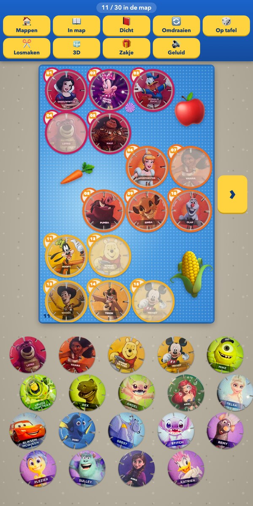

# Flippo's

> Gemaakt voor mijn neefjes, met foto's van eigen map en flippo's. Dit is geen officieel product: Diskeyz is een spaaractie van Albert Heijn, en de figuren zijn van Disney en Pixar.

Een speeltafel vol flippo's in je browser. Verzamel ze in de map, klik ze in elkaar tot een bouwwerk en scheur zelf een nieuw zakje open.

## Verzamelen

Sleep elke flippo naar zijn eigen vakje in de map. Het vakje licht op zodra je de goede flippo vastpakt. Tik op een flippo om hem om te draaien: op de achterkant staat de groente of het fruit dat erbij hoort.

Sommige flippo's glimmen. Die herken je aan de glittersticker naast hun vakje.

## Bouwen

Elke flippo heeft acht gleufjes. Sleep er twee tegen elkaar en ze klikken vast. Zo bouw je door tot je een heel bouwwerk hebt, en dat kun je daarna in 3D van alle kanten bekijken.

## Zakje openscheuren

Nieuwe flippo's nodig? Pak een zakje en scheur het zelf open door over de bovenkant te slepen. Er vallen er drie uit.

## De map

Klaar met spelen? Klap de map dicht. Je flippo's blijven veilig binnenin zitten, en je kunt de map omdraaien om de achterkant te zien.

## Ook op je telefoon

Op een telefoon zie je één pagina van de map tegelijk, zodat de flippo's groot genoeg blijven voor je vingers. Bladeren doe je met het pijltje of door te vegen, en met twee vingers zoom je in op de tafel.

## Spelen

Ga naar [flippos.bramdehart.nl](https://flippos.bramdehart.nl). Je spel wordt vanzelf bewaard.

| Wat je doet | Wat er gebeurt |
| --- | --- |
| Slepen | Flippo of bouwwerk verplaatsen |
| Twee flippo's tegen elkaar slepen | Ze klikken vast |
| Tikken | Flippo omdraaien |
| Dubbeltikken | Flippo losmaken uit een bouwwerk |
| Scrollen boven een flippo | Flippo of bouwwerk draaien |
| Knijpen, of ctrl + scrollen | In- en uitzoomen |
