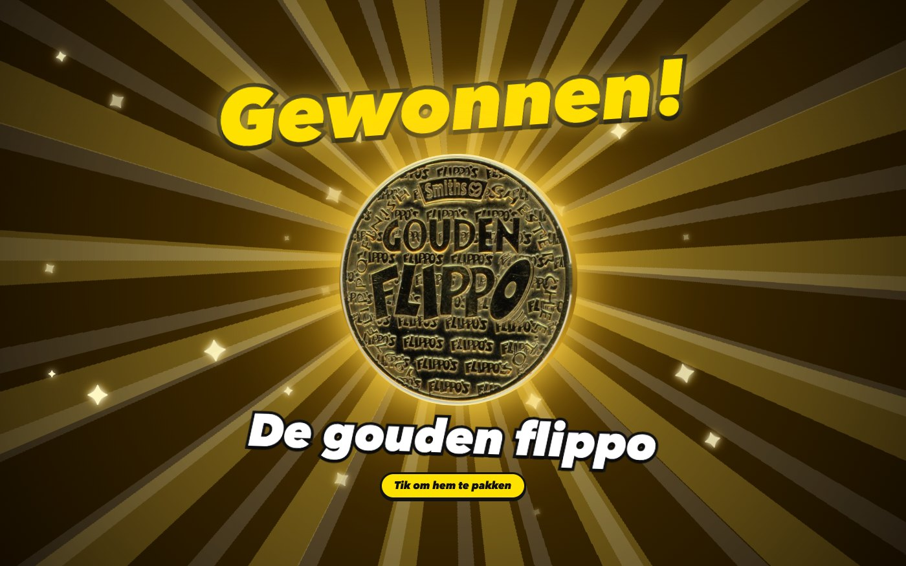
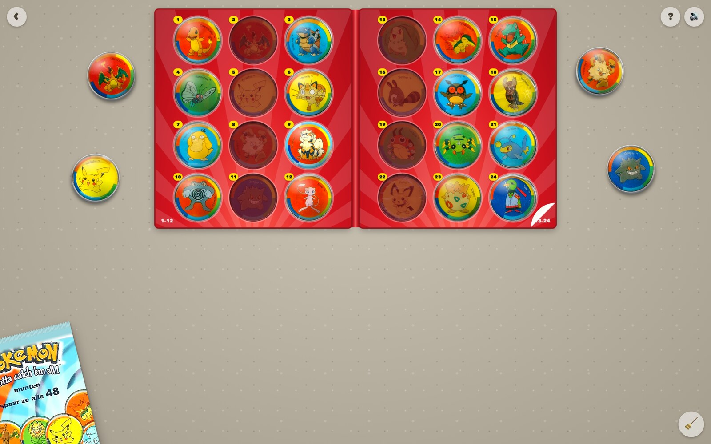
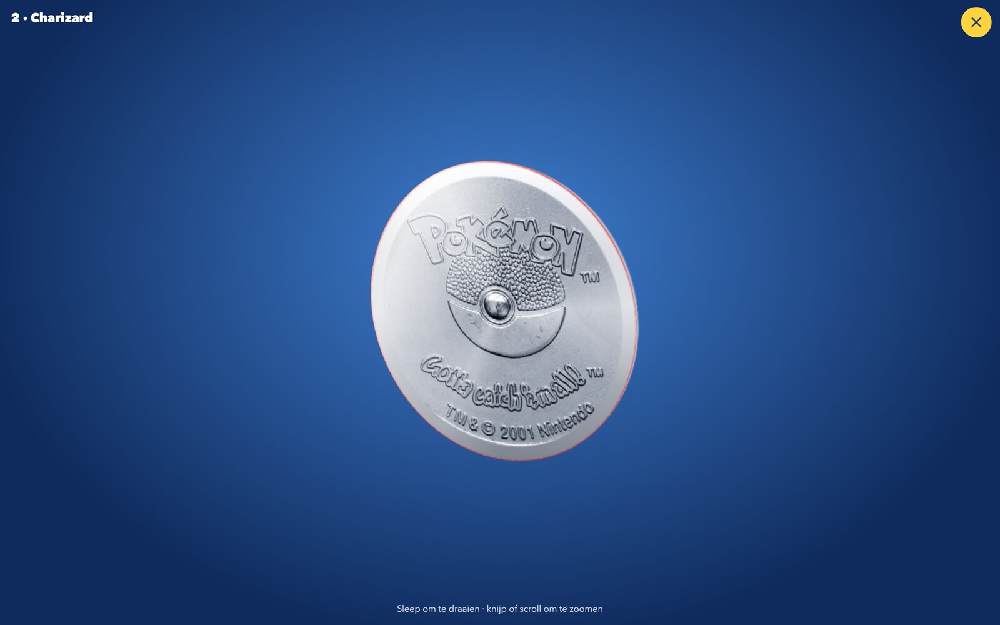

# Flippo's

> Gemaakt voor mijn neefjes, met foto's van eigen map en flippo's. Dit is geen officieel product: Diskeyz is een spaaractie van Albert Heijn met figuren van Disney en Pixar, de flippo's zijn van Smiths met figuren van Warner Bros. De Pokémon-munten zijn van Nintendo; de plaatjes daarvan komen van [LastDodo](https://www.lastdodo.nl/nl/areas/1407079-pokemon-munten). De plaatjes van de Smiths-flippo's komen van [milkcapmania.co.uk](https://www.milkcapmania.co.uk/Flippos/), die van de gouden flippo van [flippos.info](https://flippos.info/).

Een speeltafel vol flippo's in je browser. Pak een map, maak zakjes open, verzamel ze allemaal en klik ze in elkaar tot een bouwwerk. En wie een flippo-map helemaal vol spaart, wint de gouden flippo.

**Spelen: [flippos.bramdehart.nl](https://flippos.bramdehart.nl)** · Broncode: [github.com/bramdehart/flippos](https://github.com/bramdehart/flippos)

https://github.com/user-attachments/assets/7c88f2ad-2a1d-4293-9709-76ffd41c8971

## Vier mappen

Je begint bij de tafel met vier mappen, die half over elkaar liggen. Schuif erdoorheen door te vegen, te scrollen of met de pijltjestoetsen; de map in het midden ligt bovenop. Tik hem aan en hij vliegt naar zijn plek op tafel en slaat open, waarna je losse flippo's stuiterend op tafel vallen. Elke map bewaart zijn eigen verzameling. Rond de mappen liggen losse flippo's en munten, die een klein stukje uitwijken voor je muis en glimmen zoals in hun eigen map.

- **Flippo's map 1 (1995)** – de originele flippo's uit de zakken Smiths-chips, nummer 1 tot en met 250.
- **Flippo's map 2 (1996)** – het vervolg, nummer 251 tot en met 545.
- **Pokémon munten (2001)** – de 48 metalen munten van serie 1, uit de muntenmap van Konmar en Super de Boer.
- **AH Diskeyz (2026)** – de 30 Diskeyz van Albert Heijn.

## Bijna geen knoppen

Alles doe je met wat er op tafel ligt. Linksonder ligt de zak waar nieuwe flippo's uit komen, rechtsonder een bezem om de tafel leeg te vegen, en linksboven een pijltje terug naar de mappen. Rechtsboven zitten drie kleine knopjes: delen, een vraagteken en geluid aan of uit. De eerste keer krijg je een korte uitleg; het vraagteken laat hem opnieuw zien. Bij de mappen vertelt het vraagteken wat deze site is, en van wie alle figuren zijn.

Met de deelknop stuur je de site door via WhatsApp, Facebook, Snapchat, LinkedIn of X, of kopieer je de link. Op een telefoon kun je ook het deelmenu van je toestel openen.

## De originele flippo's

De flippo-mappen zijn ringbanden met insteekbladen: twintig vakjes per blad, met achter elk vakje alvast het plaatje dat erin hoort. Laat je een flippo los boven zijn vakje, dan schuift hij van boven in het hoesje. Stop je hem er met de achterkant boven in, dan blijft hij zo zitten tot je erop tikt. Op de achterkant staan het nummer en de naam van die flippo, in de stijl van zijn serie.

### Bladeren

Een bladzijde sla je zelf om: pak hem vast en sleep hem naar de andere kant, of tik op het omgekrulde hoekje. Het blad draait om met de flippo's erin en ritselt. Laat je te vroeg los, dan valt het terug. Pak je een flippo vast, dan slaat de map vanzelf open op het goede blad.

### Zak chips

Je begint met een lege map. Linksonder ligt een zak chips: tik erop en hij schuift naar het midden. Knijp in het midden en de onderkant scheurt open. De chips vallen eruit, samen met vijf flippo's, waarvan er af en toe een op zijn kop landt. Meestal zit er een nieuwe tussen. Tik ernaast als je de zak toch dicht wilt laten.

### Bouwen

Sommige flippo's hebben inkepingen in de rand: de Techno-, Strip- en Flying-flippo's. Sleep er een tegen een andere flippo en ze klikken vast; die andere hoeft zelf geen inkepingen te hebben. Alleen twee gladde flippo's passen niet aan elkaar. Houd het bouwwerk vast om het in 3D te bekijken.

### De gouden flippo

Op de zak chips staat het al: er valt iets te winnen. Spaar een flippo-map helemaal vol en de gouden flippo knalt in beeld, met stralen, sterretjes en een fanfare. Daarna ligt hij los op tafel. Je kunt hem verslepen, omdraaien en van dichtbij in 3D bekijken, maar hij heeft geen vakje in de map en de bezem veegt hem niet weg. Haal je een flippo uit de map, dan is hij weer verdwenen tot de map opnieuw vol is. Bij de mappen ligt hij stralend voor een volle map.

## Diskeyz

Sleep elke Diskey naar zijn eigen vakje. Het vakje licht op zodra je de goede vastpakt. Tik op een Diskey om hem om te draaien: op de achterkant staat de groente of het fruit dat erbij hoort. Sommige glimmen; die herken je aan de glittersticker naast hun vakje.

Elke Diskey heeft acht gleufjes, dus je kunt ze allemaal in elkaar klikken.

Ook hier begin je met een lege map. Diskeyz komen uit een zakje dat je aan de bovenkant openscheurt. Er vallen er drie uit, en meestal zit er een nieuwe tussen.

## Pokémon-munten

Een kleinere, rode map met twaalf munten per bladzijde. De munten zijn een slag groter dan flippo's en hebben een bolle glans. Ze komen uit het Super de Boer-zakje, dat je net als het zakje Diskeyz openscheurt, drie per keer, en ze vallen geregeld op hun kop.

De achterkant is van zilver en glimt flink. Houd een munt vast om hem groot te bekijken en rond te draaien. Met een snelle veeg laat je hem spinnen; dat werkt bij elke flippo en Diskey.

## De map dichtdoen en omdraaien

Sleep op de eerste bladzijde het linkerblad naar rechts en de kaft slaat dicht, met alles wat erin zit. De dichte map heeft dikte, zoals een echte. Sleep hem weer open, of sleep de andere kant op om hem om te draaien.

## Ook op je telefoon

Ook op een telefoon ligt de map open met twee bladzijden, met de rug in het midden. Hij is dan breder dan je scherm: sleep hem opzij om een hele bladzijde te zien, en sleep verder om om te slaan. Pak je een flippo vast, dan schuift zijn bladzijde vanzelf in beeld. Mikken hoeft niet: laat een flippo ergens op de map los en hij schuift in zijn eigen vakje. Met twee vingers zoom je in op de tafel. Via het deelmenu van je browser zet je de site als app op je beginscherm.

## De reclame

Er is ook een reclamespot van 80 seconden in de stijl van een speelgoedreclame uit de jaren negentig, helemaal in JavaScript: [flippos.bramdehart.nl/commercial](https://flippos.bramdehart.nl/commercial/). Zet je geluid aan. In zestien korte scènes komt alles voorbij, van de zak chips tot de gouden flippo. Hij staat ook als video in de repo: [flippos-reclame.mp4](commercial/flippos-reclame.mp4). De stem is gemaakt met een spraakmodel; met `node commercial/stem.mjs` maak je hem opnieuw.

## Alles wat je kunt doen

| Wat je doet | Wat er gebeurt |
| --- | --- |
| Een flippo slepen | Verplaatsen, of in zijn vakje stoppen |
| Op een flippo tikken | Omdraaien |
| Een flippo vasthouden | Groot en in 3D bekijken; bij een bouwwerk het hele bouwwerk |
| In de grote weergave snel vegen | De flippo of munt spint rond |
| Een flippo met inkepingen tegen een andere slepen | Ze klikken vast |
| Dubbeltikken op een flippo | Losmaken uit een bouwwerk |
| Scrollen boven een flippo | Flippo of bouwwerk draaien |
| Een bladzijde opzij slepen, of op het hoekje tikken | Bladzijde omslaan |
| Op een telefoon de map opzij slepen | De andere bladzijde in beeld; verder slepen slaat om |
| De kaft opzij slepen | Map dichtslaan, openslaan of omdraaien |
| Tikken op het zakje of de zak chips | Nieuwe flippo's openmaken; ernaast tikken legt hem terug |
| Tikken op het pijltje linksboven | Terug naar het overzicht met de mappen |
| Twee keer tikken op de bezem | Alle losse flippo's van tafel vegen; de map blijft |
| Een flippo-map helemaal vol sparen | Je wint de gouden flippo |
| Tikken op de deelknop rechtsboven | De site doorsturen of de link kopiëren |
| Tikken op het luidsprekertje | Geluid aan of uit, voor alle mappen |
| Knijpen, of ctrl + scrollen | In- en uitzoomen |
| Pijltjestoetsen | Bladeren, of door de mappen schuiven |
| Escape | Uitleg, deelkaartje, zak of grote weergave sluiten |

Je spel wordt vanzelf bewaard in je browser.
