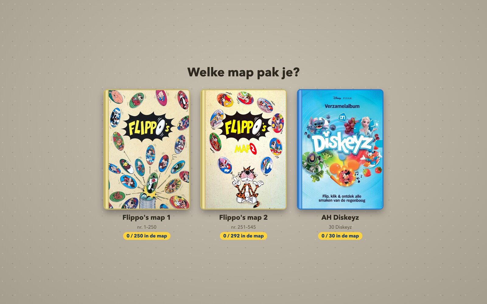
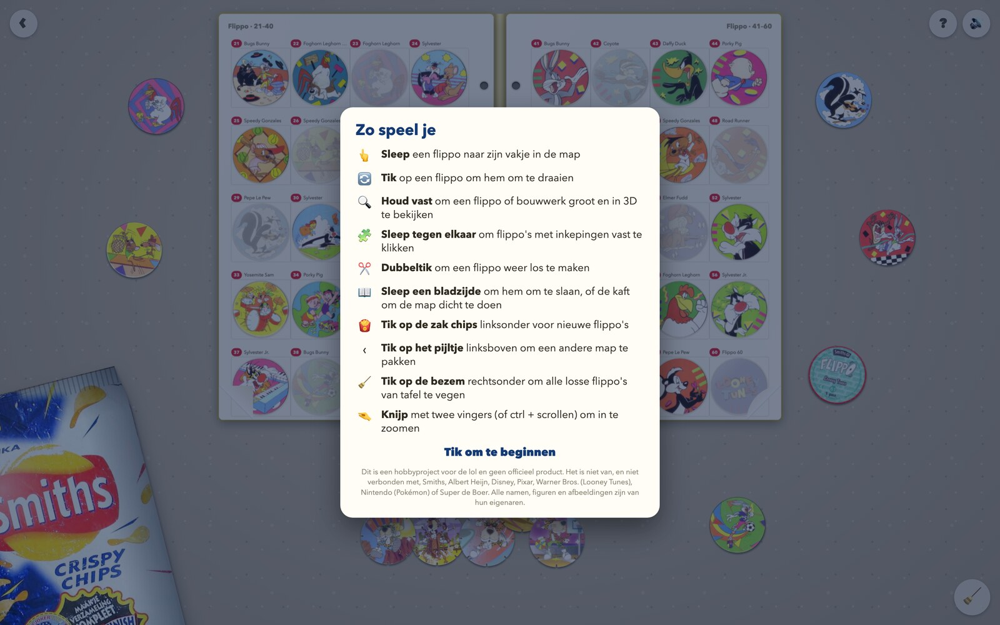
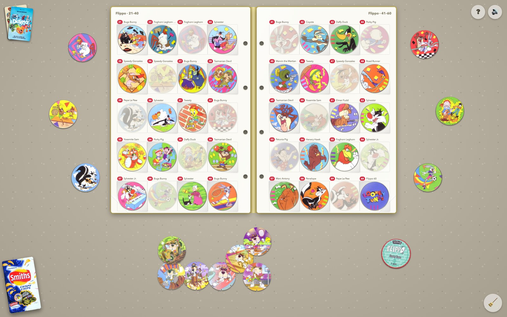
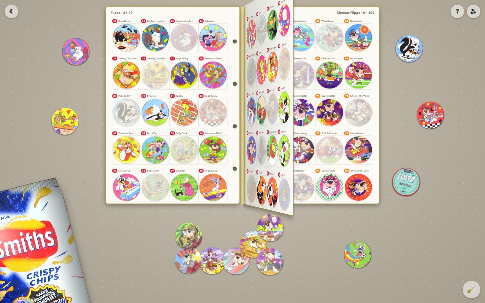
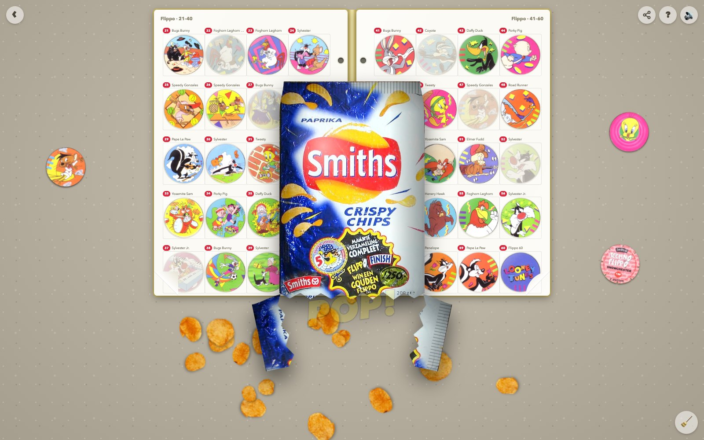
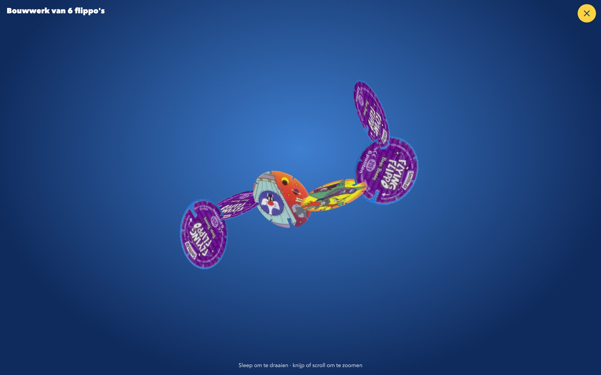

# Flippo's

> Gemaakt voor mijn neefjes, met foto's van eigen map en flippo's. Dit is geen officieel product: Diskeyz is een spaaractie van Albert Heijn met figuren van Disney en Pixar, de flippo's zijn van Smiths met figuren van Warner Bros. De plaatjes van de Smiths-flippo's komen van [milkcapmania.co.uk](https://www.milkcapmania.co.uk/Flippos/).

Een speeltafel vol flippo's in je browser. Pak een map, maak zakjes open, verzamel ze allemaal en klik ze in elkaar tot een bouwwerk.

**Spelen: [flippos.bramdehart.nl](https://flippos.bramdehart.nl)** · Broncode: [github.com/bramdehart/flippos](https://github.com/bramdehart/flippos)

## Drie mappen

Je begint bij de tafel met drie mappen. Tik er een aan en hij vliegt naar het midden en slaat open. Elke map bewaart zijn eigen verzameling.

- **Flippo's map 1 (1995)** – de originele flippo's uit de zakken Smiths-chips, nummer 1 tot en met 250.
- **Flippo's map 2 (1996)** – het vervolg, nummer 251 tot en met 545.
- **AH Diskeyz (2026)** – de 30 Diskeyz van Albert Heijn.

## Geen knoppen

Alles doe je met wat er op tafel ligt. De eerste keer krijg je een korte uitleg; het vraagteken rechtsboven laat hem opnieuw zien.

## De originele flippo's

De flippo-mappen zijn ringbanden met insteekbladen: twintig vakjes per blad, met achter elk vakje alvast het plaatje dat erin hoort. Laat je een flippo los boven zijn vakje, dan schuift hij van boven in het hoesje.

### Bladeren

Een bladzijde sla je zelf om: pak hem vast en sleep hem naar de andere kant. Het blad buigt mee en ritselt. Pak je een flippo vast, dan slaat de map vanzelf open op het goede blad.

### Zak chips

Je begint met een lege map. Linksonder ligt een zak chips: tik erop, knijp in het midden en de onderkant scheurt open. De chips vallen eruit, samen met vijf flippo's, en meestal zit er een nieuwe tussen.

### Bouwen

Sommige flippo's hebben inkepingen in de rand: de Techno-, Strip- en Flying-flippo's. Sleep er twee tegen elkaar en ze klikken vast. Houd het bouwwerk vast om het in 3D te bekijken.

## Diskeyz

Sleep elke Diskey naar zijn eigen vakje. Het vakje licht op zodra je de goede vastpakt. Tik op een Diskey om hem om te draaien: op de achterkant staat de groente of het fruit dat erbij hoort. Sommige glimmen; die herken je aan de glittersticker naast hun vakje.

Elke Diskey heeft acht gleufjes, dus je kunt ze allemaal in elkaar klikken.

Nieuwe Diskeyz komen uit een zakje dat je aan de bovenkant openscheurt. Er vallen er drie uit.

## De map dichtdoen en omdraaien

Sleep op de eerste bladzijde het linkerblad naar rechts en de kaft slaat dicht. Je verzameling blijft veilig binnenin zitten. De dichte map sleep je weer open, of je sleept de andere kant op om hem om te draaien.

## Ook op je telefoon

Op een telefoon zie je één bladzijde tegelijk, zodat alles groot genoeg blijft voor je vingers. Met twee vingers zoom je in op de tafel.

## De reclame

Er is ook een reclamespot van 80 seconden in de stijl van een speelgoedreclame uit de jaren negentig, helemaal in JavaScript: [flippos.bramdehart.nl/commercial](https://flippos.bramdehart.nl/commercial/). Zet je geluid aan.

## Alles wat je kunt doen

| Wat je doet | Wat er gebeurt |
| --- | --- |
| Een flippo slepen | Verplaatsen, of in zijn vakje stoppen |
| Op een flippo tikken | Omdraaien |
| Een flippo vasthouden | Groot en in 3D bekijken; bij een bouwwerk het hele bouwwerk |
| Twee flippo's met gleufjes tegen elkaar slepen | Ze klikken vast |
| Dubbeltikken op een flippo | Losmaken uit een bouwwerk |
| Scrollen boven een flippo | Flippo of bouwwerk draaien |
| Een bladzijde opzij slepen | Bladzijde omslaan |
| De kaft opzij slepen | Map dichtslaan, openslaan of omdraaien |
| Tikken op het zakje of de zak chips | Nieuwe flippo's openmaken |
| Tikken op het stapeltje mappen | Terug naar de tafel met de drie mappen |
| Twee keer tikken op de bezem | Alle losse flippo's van tafel vegen; de map blijft |
| Knijpen, of ctrl + scrollen | In- en uitzoomen |

Je spel wordt vanzelf bewaard in je browser.
